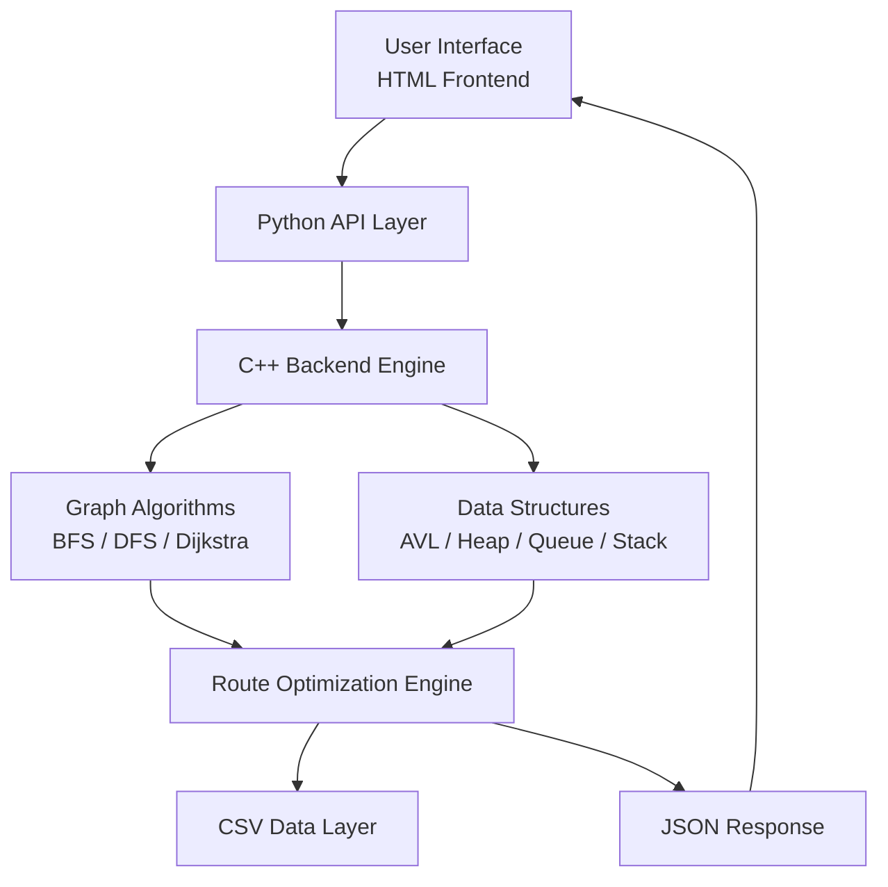

# Smart Campus Route Planner - COMSATS University Islamabad

## Project Overview

The "Smart Campus Route Planner" is a comprehensive Data Structures and Algorithms (DSA) web application built in C++. It models the COMSATS University Islamabad campus as a network of locations and paths, helping students, faculty, and visitors find optimal routes between different departments, labs, cafes, parking lots, and hostels.

This project is specifically designed to demonstrate the practical application of multiple core data structures and graph algorithms working together to solve a real-world problem.

## Core Features

1.  **Campus Traversal & Exploration:**
    *   **Show All Locations:** View a complete list of all campus locations.
    *   **Search Location:** Fast lookup of specific locations by name to see details and connected paths.
    *   **BFS/DFS Traversal:** Explore the campus map level-by-level (Breadth-First Search) or depth-first (Depth-First Search) to understand campus layout.
    *   **Show Campus Graph:** View the internal adjacency list representation of the campus network.

2.  **Route Planning & Navigation:**
    *   **Find Shortest Path:** Uses Dijkstra's algorithm to calculate the absolute shortest path (considering distance and time) between any two locations.
    *   **Show Multiple Alternate Routes:** Calculates top alternative paths in case the main route is busy or preferred to be avoided.

3.  **Dynamic Simulation & Emergency Features:**
    *   **Emergency Route Mode:** Automatically finds the nearest emergency point (like the Medical Center) from your current location using a wave-propagation approach.
    *   **Block / Unblock a Path:** Simulates real-world scenarios like construction or blocked roads by temporarily removing edges from the graph.
    *   **Check Path Connectivity:** Verifies if a path is possible between two points (useful when paths are blocked).

## Data Structures Used

This project implements all core data structures from scratch (no Standard Template Library - STL containers were used for the structures), proving a deep understanding of DSA concepts:

| Data Structure | Role in the Application |
| :--- | :--- |
| **Doubly Linked List** | Acts as the primary database in memory. It stores the detailed `Location` records loaded from the dataset. Allows easy forward and backward traversal of all campus points. |
| **Graph (Adjacency List)** | Represents the campus map. Locations are vertices, and the roads/paths between them are weighted edges (storing distance and time). |
| **AVL Tree** | A self-balancing binary search tree used as an index. It allows for extremely fast $O(\log n)$ searches for locations by their name. |
| **Priority Queue (Min-Heap)** | The engine behind Dijkstra's Shortest Path algorithm. It efficiently always serves the next closest location to explore. |
| **Stack** | Used heavily in Depth-First Search (DFS) traversals and for reconstructing the shortest path backwards from destination to source. |
| **Queue** | Used for Breadth-First Search (BFS) traversals and the Emergency Route wave propagation to find the nearest exit/medical center. |

## File Structure

*   `api_backend.cpp`: C++ backend with JSON output.
*   `server.py`: Python Flask server.
*   `index.html`: frontend logic.
*   `data/campus_map.csv`: The dataset containing locations and the paths connecting them.
*   `models/Location.h`: Defines the properties of a campus location.
*   `structures/`: Contains the custom implementations of `DoublyLinkedList`, `Stack`, `Queue`, `PriorityQueue`, and `AVLTree`.
*   `graph/Graph.h`: The Adjacency List graph implementation.
*   `algorithms/`: Contains the logic for `Dijkstra`, `BFS`, and `DFS`.
*   `utils/FileLoader.h`: Parses the CSV dataset and populates the data structures.

---

## System Architecture Diagram


---

## Setup 

### Step 1 — Install Python packages
Open a terminal in this folder and run:
```
pip install flask flask-cors
```

### Step 2 — Compile the C++ backend

**Windows (with MinGW / g++):**
```
g++ -o api_backend.exe api_backend.cpp
```


---

## Run the project (every time)

### Step 1 — Start the server
```
python server.py